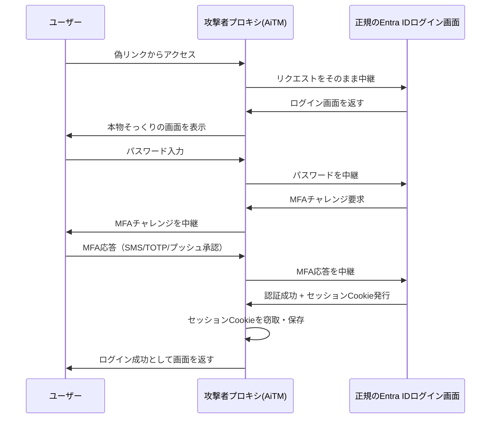

「MFAを導入しているから安全」——この前提そのものを攻撃対象にしているのが AiTM（Adversary-in-the-Middle）型フィッシングだ。

従来型のフィッシングは「偽サイトでパスワードを盗む」だけだった。AiTMはこれを一段進化させ、**攻撃者のサーバが本物のログイン画面とユーザーの間に丸ごと割り込む**リバースプロキシ構成をとる。



ポイントは、パスワードだけでなく**MFAのやり取りごとそのまま中継する**ことだ。ユーザー本人が正規のMFA（SMSコード・Authenticatorアプリのプッシュ承認等）に正しく応答してしまうため、本人は「いつも通りログインできた」としか感じない。攻撃者が最終的に盗むのは認証済みの**セッションCookie**であり、これがあればパスワードもMFAも二度と要求されずにログイン状態を再現できる。[Microsoft自身も2023年の時点でこの手口による多段階のビジネスメール詐欺(BEC)キャンペーンを確認・警告している](https://www.microsoft.com/en-us/security/blog/2023/06/08/detecting-and-mitigating-a-multi-stage-aitm-phishing-and-bec-campaign/)。

---

## 🎯 なぜMicrosoftだけが突出して狙われ続けるのか

このリバースプロキシ手口がどれほどの規模で動いていたかは、[Check Point Researchのブランドフィッシングレポート](https://blog.checkpoint.com/research/which-brands-are-impersonated-most-inside-the-q2-2026-brand-phishing-report/)を四半期で並べると見えてくる。

| 四半期 | Microsoft | 2位 | 3位 |
|---|---|---|---|
| 2025 Q4 | [22%](https://blog.checkpoint.com/research/microsoft-remains-the-most-imitated-brand-in-phishing-attacks-in-q4-2025/) | Google 13% | Amazon 9% |
| 2026 Q1 | [22%](https://blog.checkpoint.com/research/the-phishing-paradox-the-worlds-most-trusted-brands-are-cyber-criminals-entry-point-of-choice/) | Apple 11% | Google 9% |
| 2026 Q2 | [23%（2位のほぼ2倍）](https://blog.checkpoint.com/research/which-brands-are-impersonated-most-inside-the-q2-2026-brand-phishing-report/) | LinkedIn 11.6% | Google 6.7% |

Microsoftは4四半期連続でトップを独占し、直近では2位ブランドの約2倍の量を集めている。2位以下がGoogle・Apple・LinkedIn・Amazonと入れ替わる中でMicrosoftだけが動かないのは、狙われているのがブランドの知名度そのものではなく、**その先にある企業のID基盤（Entra ID）へのログインフロー**だからだ。Check Pointの分析はこの集中を「攻撃者は"誰もが知っていて毎日使うブランド"の少数精鋭に絞り込んでいる」と説明している。

---

## 📊 実例：Tycoon 2FAというフィッシングキットの規模

AiTMは理論上の脅威ではなく、実際に大規模インフラとして稼働していた。代表格が2023年8月から活動していた「Tycoon 2FA」というPhaaS（Phishing-as-a-Service）キットだ。

| 指標 | 数値 |
|---|---|
| ピーク時、Microsoftがブロックしたフィッシング全体に占める割合 | [約62%](https://thehackernews.com/2026/03/europol-led-operation-takes-down-tycoon.html) |
| 2025年10月単月のブロック済み悪性メール数 | [1,300万通超](https://thehackernews.com/2026/03/europol-led-operation-takes-down-tycoon.html) |
| 影響を受けた組織数（Europol発表、学校・病院・公共機関含む） | [世界で約10万組織](https://thehackernews.com/2026/03/europol-led-operation-takes-down-tycoon.html) |
| 被害確認件数が最も多かった国（米国） | [179,264件](https://thehackernews.com/2026/03/europol-led-operation-takes-down-tycoon.html) |

2026年3月、Microsoftとユーロポール主導の連合作戦により**330ドメインが押収され、Tycoon 2FAのインフラは摘発された**。ただしPhaaSモデルの常として、キット自体が消えても「Entra ID／Google Workspaceのログイン画面を偽装してセッションCookieを盗む」という手口自体は他の後継キットに引き継がれる構造にあり、摘発は個別インフラの停止であって手口そのものの終息ではない点に注意が必要だ。

### 補足：「じゃあGoogleに乗り換えれば安全」ではない

ここまで読むと「Entra IDが狙われやすいなら、Google Workspaceに切り替えれば防げるのでは」と考えたくなるが、それは誤解だ。Tycoon 2FAを技術解析した[Elastic Security Labsのレポート](https://www.elastic.co/security-labs/tycoon-2fa-aitm-detection-engineering)によれば、このキットは「被害者と正規のID基盤（**Entra IDまたはGoogle**）の間に割り込むリバースプロキシ」として設計されており、Google Workspace向けの攻撃フローもEntra ID向けと並行して独立に実装されている。Google版もTOTP/SMS/プッシュ通知のコードをリアルタイムで中継して2段階認証を完了させ、Google Chromeの正規OAuthクライアント（client ID: `77185425430`）を悪用してデバイス登録まで行う、Entra版と同等に洗練された仕組みだ。

つまり冒頭のCheck Point統計でMicrosoftが突出しているのは、Entra IDというプラットフォームが技術的に他社より弱いからではなく、**企業向けID基盤としての導入規模が大きく、攻撃者にとって「刈り取れる母数が最も大きい標的」だから**という市場シェアの反映にすぎない。AiTMは特定ベンダーの脆弱性ではなく、Webベースのセッションベース認証フロー全般に共通する構造的な弱点を突く手法である以上、ID基盤を乗り換えること自体は解決策にならない。この記事で挙げるフィッシング耐性MFA（FIDO2/パスキー等）への移行は、Google Workspaceでもセキュリティキー・パスキーとして同様に提供されており、対策の本質はベンダー選びではなく認証方式の選び方にある。

---

## 🇯🇵 日本国内の状況は？

Check PointやMicrosoft/Europolの統計はグローバル集計であり、**AiTM単体と断定できる被害を企業名入りで公表した国内一次情報は見つからなかった**。ただし関連する実例は2つある。

- **千葉大学のMicrosoft 365不正アクセス**（2026年1月30日発生・4月17日公表）：学生アカウント1件から短時間に630件の迷惑メールが送信されたことで発覚し、全4アカウントを緊急停止。個人情報が閲覧された可能性があるとして該当学生に個別連絡している（[大学公表を報じた記事](https://rocket-boys.co.jp/security-measures-lab/chiba-univ-m365-unauthorized-access-spam-sent/)）。**大学発表からは手口がAiTMかどうかまでは断定できない**が、日本国内でもMicrosoft 365そのものが乗っ取りの標的になったインシデントケースとして確認できる。
- **パスキー登録を狙う「Pink」ビッシング攻撃**（2026年4〜7月、Okta Threat Intelligence／Palo Alto Networks Unit 42が分析）：ITサポートを装う電話でMicrosoft Entraのパスキー登録"ナッジ"を悪用し、攻撃者自身のFIDO2パスキーを被害者アカウントに登録させる手口。航空・医療・テクノロジー等6業界で被害が確認されている（[日本語で報じた記事](https://www.zaikei.co.jp/article/20260713/861005.html)）。AiTMプロキシ型とは異なる手口だが、**日本企業が標的に含まれるとの明記はない**。それでも、この記事が推奨する「フィッシング耐性MFA（FIDO2/パスキー）への移行」自体の登録プロセスに新たな攻撃面が生まれるという点で、国内で移行を進める組織にも直接関わる教訓といえる。

---

## ⚠️ なぜ「対策済み」のはずなのに機能していないのか

ここがこの分野最大の落とし穴だ。「MFAを導入している」「Conditional Accessを設定している」という組織でも、実際にはAiTMへの防御になっていないケースが2パターンある。

### 罠1：従来型MFAはAiTMの主標的そのもの——TOTPアプリも例外ではない

SMSコード・音声通話・番号一致なしのプッシュ承認といった「第一世代」のMFAは、AiTMがまさにリレーして盗む対象だ。Microsoft自身が公式ドキュメントで明言している。

> "Traditional MFA methods such as SMS codes, email-based OTPs, and push notifications are becoming less effective against today's attackers... Traditional MFA is no longer enough—phishing-resistant MFA is the new baseline."
>
> （[Microsoft Learn「Phishing-resistant MFA」](https://learn.microsoft.com/en-us/security/zero-trust/sfi/phishing-resistant-mfa)）

ここで見落とされがちなのが、**Microsoft/Google Authenticatorが生成するTOTP（30〜60秒ごとに変わる6桁コード）も、SMSと同じ「フィッシング可能」なカテゴリに含まれる**という点だ。「アプリ内で生成される分、SMSより安全」と思われがちだが、AiTMからすればコードの発行経路（SMS経由か、アプリ内生成か）は無関係で、**「有効期限内に人間が画面へ入力し、それを転送できる値」であること自体が突破口**になる。実際、前述の日本国内の関連事例（「Pink」ビッシング攻撃）の攻撃基盤も、SMSコード用の`/submit-otp`とTOTPコード用の`/submit-authenticator`を別々に用意し、どちらもオペレーターが数秒以内に本物のログイン画面へ入力し直していた。番号一致プッシュ通知はAiTM側に本物の画面へ表示された番号をリアルタイムで提示し直す手間を強いる分だけ一段強いが、これも人間が操作する高度なAiTMには通用しうるため、[CISAの「フィッシング耐性MFA導入ファクトシート」](https://www.cisa.gov/sites/default/files/publications/fact-sheet-implementing-phishing-resistant-mfa-508c.pdf)でも真にフィッシング耐性ありとされているのはFIDO2/WebAuthnとPIV/CACのみで、番号一致プッシュはそこに含まれていない。

つまり「MFA導入率100%」という報告は、SPF/DKIM/DMARCの`p=none`運用と同じ構造の見せかけになりうる。中身がSMS・音声・TOTP・番号一致なしプッシュのいずれかである限り、AiTMに対しては効果が薄い。

### 罠2：Token Protectionは「ブラウザ経由の盗難」をほぼカバーしていない

AiTM対策として名前が挙がることが多いConditional Accessの「Token Protection」機能（トークンを端末に暗号学的に紐付け、盗まれても他端末で使えなくする仕組み）にも、見落とされがちな適用範囲の制限がある。[Microsoft公式ドキュメント（2026-08-10更新）](https://learn.microsoft.com/en-us/entra/identity/conditional-access/concept-token-protection)によると：

| 対象 | ネイティブアプリ | ブラウザ経由 |
|---|---|---|
| Windows | GA（一般提供） | Azure Resource Managerにアクセスする一部Webアプリのみ、プレビュー |
| iOS/iPadOS | プレビュー | **非対応** |
| macOS | プレビュー | Azure Resource Manager向けの一部Webアプリのみ、プレビュー |

対応リソースもExchange Online・SharePoint Online・Teamsの**ネイティブアプリ**が中心で、ブラウザ経由の保護は「Azure Resource Managerにアクセスする一部Webアプリ」というごく限られた範囲のプレビュー機能にとどまる。一方、Tycoon 2FAのようなAiTMキットが実際に盗むのは、まさに**ブラウザでOutlook on the webやSharePoint onlineにログインした時のセッションCookie**だ。つまり「Token Protectionを有効化したから安心」という理解は、現状の対応範囲を踏まえるとほぼ的外れになる。Microsoft自身も「Token Protectionは多層防御の一部として使うこと」と注記しており、単体での万能な解決策とは位置づけていない。

---

## 🔍 実務者ができるチェックポイント

1. **MFAの中身を棚卸しする**：Conditional AccessでMFAを要求していても、許可している認証方法がSMS/音声/TOTPアプリ/番号一致なしプッシュ通知中心なら、AiTMに対しては実質無防御に近い。「Authenticatorアプリを使っているから安全」という誤解が特に多いので、まず実数を確認する。Entra管理センターの[Entra ID > 認証方法 > アクティビティ](https://learn.microsoft.com/en-us/entra/identity/authentication/howto-authentication-methods-activity)（Entra ID P1/P2ライセンス必須）に「登録」「使用状況」の2タブがあり、ユーザーごとにどの認証方法で実際にサインインしているかを確認できる。ここでSMS/TOTP/音声が多数を占めていれば、罠1がそのまま自組織に当てはまっている状態だと分かる。
2. **フィッシング耐性MFAへの移行を優先する**：ここまでの2つの罠を踏まえると、対症療法では埋まらない構造が見えてくる。罠1の通りSMS・音声・TOTP・番号一致なしプッシュは発行経路を問わず「人間が入力して転送できる値」である以上いずれもAiTMに筒抜けで、罠2の通りToken Protectionもブラウザ経由のセッションCookie窃取（AiTMの主要な手口）をほぼカバーしない。つまり「MFAの種類を強化する」「Conditional Accessを足す」といった積み増しでは根本解決にならない。残る道は、[認証そのものを端末とドメインに暗号学的に紐づけ、そもそも"中継できる値"を発生させないFIDO2セキュリティキー・パスキー・Windows Hello for Business・証明書ベース認証](https://learn.microsoft.com/en-us/security/zero-trust/sfi/phishing-resistant-mfa)への切り替えだけであり、これが唯一の根本対策になる。Microsoft社内でも「従業員の生産性アカウントの92%をフィッシング耐性認証で保護」という段階まで、Secure Future Initiativeの下で計画的にロールアウトしている（=一朝一夕には終わらない規模の移行だと自認している）。
3. **リスクベースConditional Accessを重ねる**：フィッシング耐性MFAへの移行が完了するまでの当座しのぎとして、Microsoftが用意している[Conditional Accessテンプレート「Require multifactor authentication for risky sign-ins」](https://learn.microsoft.com/uk-ua/entra/id-protection/concept-identity-protection-policies)を使う。サインインリスクが「High」または「Medium」と判定された場合にMFAを要求（または遮断）する設定で、AiTMで盗まれたセッションCookieが別のIP・デバイスから使われた際の異常検知を狙える。ただし**MFA未登録ユーザーは通知なしにブロックされる**という副作用があるため、有効化前に全ユーザーのMFA登録を完了させておく必要がある。
4. **レガシー認証プロトコルを無効化する**：POP3・IMAP・SMTP AUTH・Exchange ActiveSyncの旧Basic認証・古いOfficeクライアントといったレガシープロトコルはMFAそのものに対応しないため、AiTMとは別系統の「MFAをそもそも経由しない」抜け穴になる。Microsoft自身の分析では、[クレデンシャルスタッフィング攻撃の97%以上、パスワードスプレー攻撃の99%以上がレガシー認証プロトコル経由](https://learn.microsoft.com/en-us/entra/identity/conditional-access/policy-block-legacy-authentication)だという。Conditional Accessテンプレート「Block legacy authentication」で一括ブロックできるが、事前に自組織でレガシープロトコルを使っているアプリ（古いPOP/IMAPメールクライアント等）が残っていないか、サインインログでの確認が前提になる。
5. **Token Protectionは"効く範囲"を理解した上で導入する**：Entra ID P2ライセンスが必要で、Conditional Accessポリシーの「セッション」項目にある「トークン保護」で設定する。対応リソースをExchange Online・SharePoint Online・Teamsの**ネイティブアプリ**（Outlookデスクトップ版等）に絞って有効化すれば、そこだけは端末紐付けによる保護が効く。ただしブラウザ経由のセッション窃取（AiTMの主要な手口）はほぼ対象外という前提を崩さず、単独の対策ではなく多層防御の一枚として位置づける。いきなり全ユーザーに強制すると互換性のない端末・アプリでサインインできなくなるため、[Microsoft公式手順ではレポート専用モードでの試験運用→対象ユーザーを段階的に拡大という順序を推奨している](https://learn.microsoft.com/en-us/entra/identity/conditional-access/concept-token-protection)。

---

## 📊 まとめ

```
防御力
  高 │ FIDO2/パスキー・証明書ベース  ██████████  ← "中継できる値"自体が発生しない
     │ 番号一致プッシュ              ████        ← 人力AiTMには通用しうる
     │ SMS/音声/TOTP/通常プッシュ    ██          ← AiTMがそのままリレーして盗める
  低 │ MFAなし                       ─
     └───────────────────────────────────────
         ↑ Token Protectionの保護範囲は
           ネイティブアプリ中心。ブラウザ経由の
           セッションCookie窃取（AiTMの主要手口）は
           ほぼカバー対象外
```

この図が示すのは「対策の数」と「対策の効果」は別軸だということだ。MFAを導入し、Conditional Accessを設定し、Token Protectionまで有効化していても、その中身がAiTMに中継可能な値（SMS・TOTP・番号一致なしプッシュ）とブラウザ非対応のトークン保護である限り、防御力は図の下段からほとんど動かない。「対策済み」という報告の中身——**やったかどうかではなく、AiTMという具体的な攻撃手法に対して実際に効くかどうか**——を疑う視点なしには、この分野の実務は成立しない。

---

**情報源**:
- [Check Point Research「Which Brands Are Impersonated Most? Inside the Q2 2026 Brand Phishing Report」](https://blog.checkpoint.com/research/which-brands-are-impersonated-most-inside-the-q2-2026-brand-phishing-report/)
- [Check Point Research「The Phishing Paradox」（2026年Q1データ）](https://blog.checkpoint.com/research/the-phishing-paradox-the-worlds-most-trusted-brands-are-cyber-criminals-entry-point-of-choice/)
- [Check Point Research「Microsoft Remains the Most Imitated Brand in Phishing Attacks in Q4 2025」](https://blog.checkpoint.com/research/microsoft-remains-the-most-imitated-brand-in-phishing-attacks-in-q4-2025/)
- [The Hacker News「Europol-Led Operation Takes Down Tycoon 2FA Phishing-as-a-Service」（2026年3月）](https://thehackernews.com/2026/03/europol-led-operation-takes-down-tycoon.html)
- [Elastic Security Labs「Tycoon 2FA AiTM detection engineering」（Entra IDとGoogle Workspace双方の攻撃フローを技術解析）](https://www.elastic.co/security-labs/tycoon-2fa-aitm-detection-engineering)
- [Microsoft Security Blog「Detecting and mitigating a multi-stage AiTM phishing and BEC campaign」（2023年6月）](https://www.microsoft.com/en-us/security/blog/2023/06/08/detecting-and-mitigating-a-multi-stage-aitm-phishing-and-bec-campaign/)
- [Microsoft Learn「Phishing-resistant MFA」（Secure Future Initiative）](https://learn.microsoft.com/en-us/security/zero-trust/sfi/phishing-resistant-mfa)
- [Microsoft Learn「How Token Protection Enhances Conditional Access Policies」（2026-08-10更新）](https://learn.microsoft.com/en-us/entra/identity/conditional-access/concept-token-protection)
- [CISA「Implementing Phishing-Resistant MFA」ファクトシート](https://www.cisa.gov/sites/default/files/publications/fact-sheet-implementing-phishing-resistant-mfa-508c.pdf)
- [Microsoft Learn「Block legacy authentication with Conditional Access」（クレデンシャルスタッフィング97%・パスワードスプレー99%の統計出典）](https://learn.microsoft.com/en-us/entra/identity/conditional-access/policy-block-legacy-authentication)
- [セキュリティ対策Lab「千葉大学、Microsoft 365アカウントへの不正アクセス」（2026年4月17日公表分の報道）](https://rocket-boys.co.jp/security-measures-lab/chiba-univ-m365-unauthorized-access-spam-sent/)
- [財経新聞「Microsoft 365のパスキー登録を悪用する標的型攻撃、6業界で被害拡大」（Tech Times記事の日本語訳、2026年7月13日）](https://www.zaikei.co.jp/article/20260713/861005.html)
